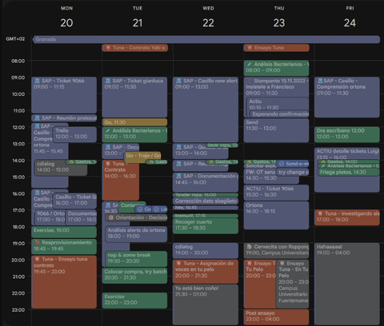
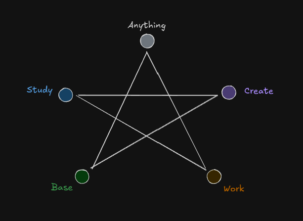

_October 13, 2025_

Wanna see how hard I try?

In order to be aligned with my projections and be consequent, understand life better, and get closer to these desires of mine, I built myself a knowledge system where I could trace my activities and knowledge and even examine and improve myself.

One of the things I've learnt is I'm quite disorganized... What a novelty.

There's a lot of interesting literature as well and I believe there's a lot to learn and mastering this abilty can lead you to better alignment in your life.

So I define the blocks along this tree.

Under 5 categories previously designed for 5 vertex balance.

Which then I paint my calendar with:

This is based on what I wrote some years ago about time balance. Part of a writing project called "Box Method" that I might add here some day.

So basically this is the balance star:

There's 5 main areas.

Base: Eat, exercise, shower, clean, go to the dentist, take care of yourself and your basic stuff. It's like the earth to plant on.

Work: Anything you do to get material benefit from the world. Making money or growing your vegetables. Anything that you will actually eat from and get the goods needed to support 'base' vertex. This is like the water you use on your earth.

Study: Learning. Whatever you do to become better. Reading, studying, growing as a person, anything that's involving your enerrgy on learning things you didn't know before. It's like the minerals you put on the earth. What you nurture it with.

Create: Your projects, your creative projects. What you're creating that was not there. The result of your step in the world. Writing, composing, painting, building your own business, having children. Your creation. It's like the tree that grows from the earth.

Anything: Freedom! Just anything. Recreation, contemplation, experiencing life, pleasure of any kind. It's like a blank canvas where you just stop thinking of compromises and just let the horses free and see what they do. This is like the sun and day cicle. It governs everything. It makes your plant grow. Like what most people call "free" time. Though sometimes it's not that free, because when you work that much, you force yourself to "use your free time wisely" and in the end you're not free.

For me, I believe the least balanced star you can have looks like this (in hours)

However, a more realistic one:

![[20260214150947.png]]

For someone who doesn't possess passive incomes allowing him/her not to work.

You can definitely use a strategic design of your activities so as to invest your time in multiple vertices simoultaneously though.

If you look closely, it's even fun to relate every vertex to an element of chinese medicine.

Base: Earth  
Work: Water  
Study: Metal  
Create: Wood  
Free: Fire

Not because of the sensations they provide, but the pulsion or result they produce

The earth is the base for everything. Without it nothing would be possible. The water is needed by the earth to grow something in it. The metal (minerals) enrichens the earth and nourishes whatever grows in it. Things can still grow in poor soil, but the richest, the better. Just like wisdom and knowledge. The wood is what grows as a result. The support of a tree that ends up giving a fruit, which then leaves a seed on the earth for other tree to grow. The sun provides inspiration for trees to grow. Each one at their own pace.

It's beautiful poetry!

So, trying to respect this, I paint my calendar with hours. And then, within each block, there are subdivisions of projects and priorities as well. Like things that need to be done periodically and things that need to be done for improvement.

Has it worked? Well... Kind of. It actually helped some time, and at least the system, as a knowledge base, works very well.